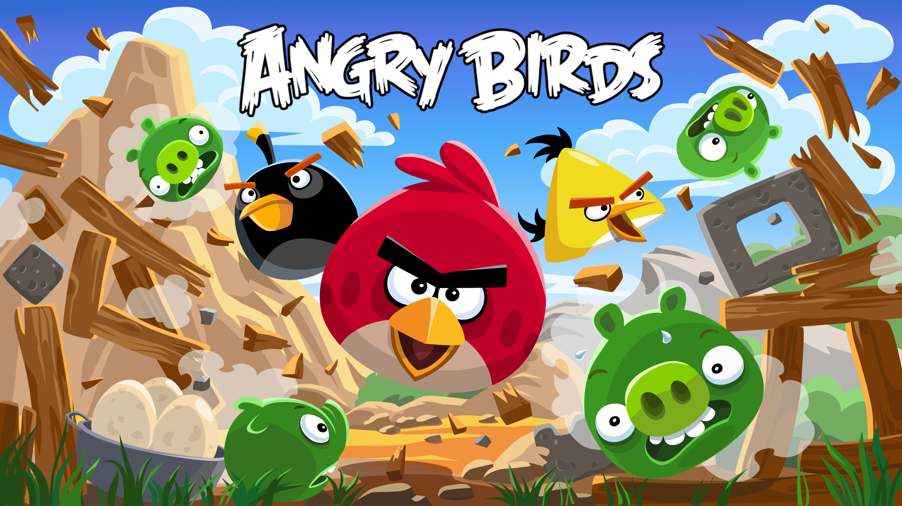
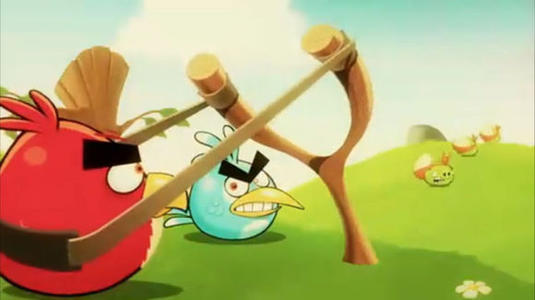

# 操作指南

## Angry Bird
愤怒的小鸟是一款经典的休闲游戏。在这款游戏中，玩家将操控各种各样的小鸟，利用弹弓把小鸟们弹射出去，消灭捣蛋猪，从他们手中夺回家园。
## 操作方法
玩家可以用鼠标拖动小鸟进行拉弓，选择合适的角度，然后松开弹弓，小鸟就会嗖地一下飞出去...当然目标是可恶的绿猪。用有限的小鸟，选择合适的角度和策略去打败所有的捣蛋猪吧。  
  
此外，不同的鸟还拥有不同的特殊技能。  
  
黄色的三角小鸟，在空中再次点击鼠标，他就会以更快的速度冲刺出去，撞倒更多的小猪。  
   
黑色的炸弹鸟，再次点击鼠标之后他就会像炸弹一样炸开，”嘣“地消灭周围的敌人和建筑  
  
绿色的回旋鸟，在空中再次点击鼠标，他就会...以一个及其诡异的角度转变方向。吼吼，更多的就还请在游戏中继续探索了。  
  
此外，还有一个最特别的小鸟，那就是我们的——大红鸟。  
虽然看起来又大又老，但是他却是最强的小鸟——他不但拥有更大的碰撞体积和无与伦比的质量，此外，玩家还可以手动控制它——在空中再次点击鼠标，他就会改变速度方向，迅速飞向鼠标所在的位置，实现精确的定点打击。  
## 特殊玩法
锵锵，金蛋关卡。  
   
在金蛋关卡中，玩家需要在消灭捣蛋猪的同时保护金蛋。如果金蛋全部都碎掉了...呜呜，游戏就会输掉。相反，如果玩家合理地保护了金蛋，那么会得到金闪闪的加分奖励！这简直太酷了。
